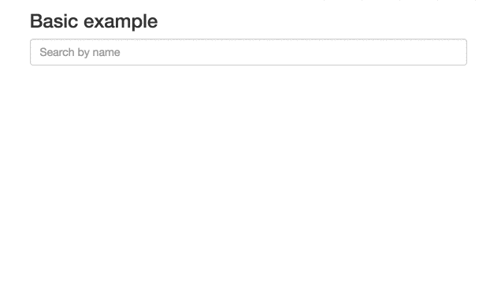

# Асинхронная обработка

## src/Autocomplete.jsx

Реализуйте компонент `<Autocomplete />`, который представляет собой текстовое поле с автодополнением списка стран. Автодополнение срабатывает только в том случае, если указан хотя бы один символ. Для пустого запроса ничего не выводится.



Список стран можно получить, сделав запрос:

```js
const res = await axios.get("/countries", { params: { term: "al" } });
console.log(res.data); // => ["Albania","Algeria"]
```

где `term` – это начало слова (любое количество символов введенное пользователем).

Начальный HTML:

```html
<div>
  <form>
    <input type="text" class="form-control" placeholder="Enter Country" />
  </form>
</div>
```

HTML после ввода "al":

```html
<div>
  <form>
    <input type="text" class="form-control" placeholder="Enter Country" />
  </form>
  <ul>
    <li>Albania</li>
    <li>Algeria</li>
  </ul>
</div>
```

## Подсказки

- В качестве `key` для элементов списка используйте название страны.
- Запросы могут выполняться разное время. Например, если ввести «a», а затем быстро стереть символ, то последний запрос( с пустой строкой) может выполниться раньше, чем первый запрос с буквой «a». В этом задании вам не нужно об этом беспокоится. В реальных проектах такое поведение решается с помощью задержки запроса перед каждым вводом.
